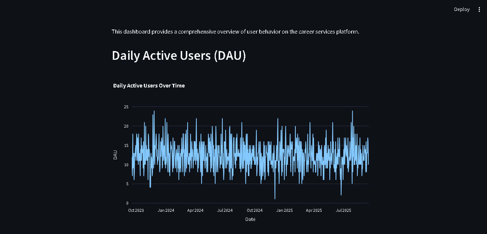
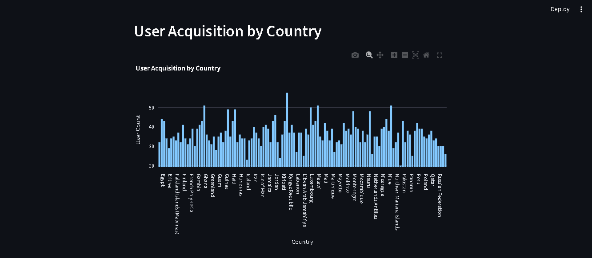
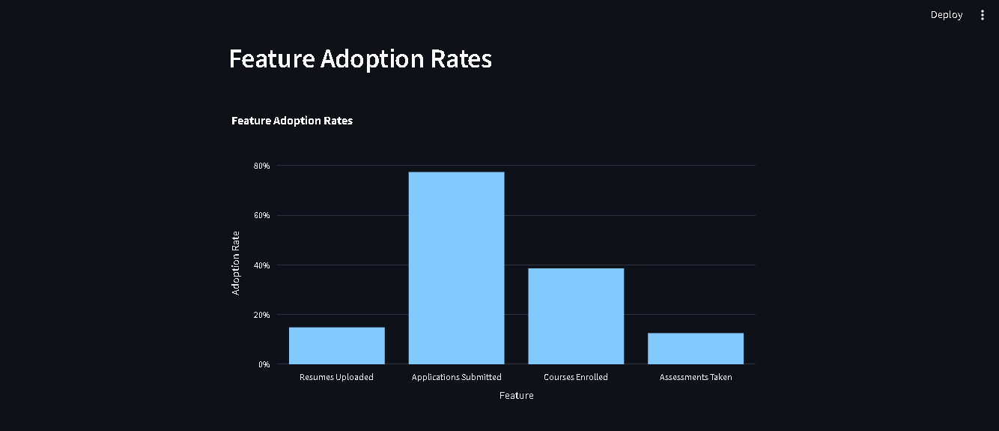

# Career Services User Behavior Analytics Dashboard

This project demonstrates a complete, end-to-end data analytics pipeline. It transforms raw data into a clean, structured format and visualizes it on a live, interactive dashboard. The solution provides a clear view into user behavior and engagement, enabling career services departments to make data-driven decisions.

<br>

## Core Technologies

This project was built using a modern data stack, showcasing my expertise in the following technologies:

* **dbt (data build tool):** Used to transform raw user data into clean, structured datasets (`fact_user_activity` and `dim_users`). This demonstrates proficiency in data modeling and SQL-based transformations.
* **Python:** The primary language used for the backend of the application, data processing, and orchestrating the dashboard logic.
* **Streamlit:** A powerful Python framework for building and sharing interactive data applications. The dashboard allows for real-time visualization of key performance indicators.
* **MySQL:** Serves as the data warehouse where all transformed data is stored, making it accessible for analysis and visualization.
* **Git & GitHub:** Used for version control and collaborative development, ensuring the project is organized and professionally managed.

<br>

## Key Visualizations & Insights

The dashboard provides a clear view into user activity and platform health, including:

* **Daily Active Users (DAU):** A line chart that tracks user engagement over time.
* **User Acquisition by Country:** A bar chart visualizing the geographic distribution of new users.
* **Feature Adoption Rates:** A bar chart that measures how many users have engaged with key features such as resume uploads, job applications, and course enrollment.

  

  

  

<br>

## Project Structure

The project is organized to follow industry-standard best practices for analytics engineering:

* `my_dbt_project/`
    * `app.py`: The Python application that serves the interactive Streamlit dashboard.
    * `dbt_project.yml`: The dbt project configuration file.
    * `models/`: Contains all dbt SQL models for data transformation.
    * `requirements.txt`: Lists all Python dependencies required to run the dashboard.
    * `.env`: A local file for storing sensitive credentials (not pushed to GitHub).
    * `.gitignore`: Prevents sensitive files and build artifacts from being committed.

<br>

## How to Run This Project

To get this project running on your local machine, follow these steps:

1.  **Set Up MySQL:** Ensure you have a running MySQL server.
2.  **Clone the Repository:**
    ```bash
    git clone [https://github.com/akeDataAnalyst/career-services-dashboard.git](https://github.com/akeDataAnalyst/career-services-dashboard.git)
    cd career-services-dashboard
    ```
3.  **Set Up the Python Environment:**
    ```bash
    python -m venv venv
    venv\Scripts\activate  # On macOS/Linux, use: source venv/bin/activate
    pip install -r requirements.txt
    ```
4.  **Configure Credentials:** Create a file named `.env` in the root directory and add your database credentials.
    ```
    DB_HOST=localhost
    DB_USER=your_username
    DB_PASSWORD=your_password
    DB_DATABASE=your_database_name
    ```
5.  **Run dbt Models:** Execute the dbt models to transform the data and load it into your database.
    ```bash
    dbt run
    ```
6.  **Run the Dashboard:** Start the Streamlit application.
    ```bash
    streamlit run app.py
    ```
    The dashboard will be available in your browser at `http://localhost:8501`.
